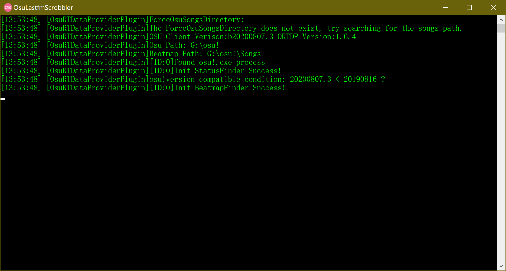

# OsuLastfmScrobbler
Last.fm Scrobbler of Osu!.

## How to use?

1. Download [OsuLastfmScrobbler.zip](https://github.com/iMyon/OsuLastfmScrobbler/releases)
2. Extract zip file(prefer `<osu_dir>\OsuLastfmScrobbler`), then run `.exe`.
3. In the first run, this application generates `config.ini`, set your configuration and reopen the application.
4. This application will try to open `osu!.exe`, otherwise you can open osu yourself.

## Config.ini

[OsuScrobbler.Settings]

Setting Name|Description
------------|-------------------
LastfmApiKey|`apiKey` of Last.fm, you can create your API account at https://www.last.fm/api/account/create
LastfmApiSecret|`apiSecret` of Last.fm. 
LastfmUsername|Your Last.fm username.
LastfmPassword|Your Last.fm password.

Once your configuration is valid and osu is running, you can see the success info like this:

Enjoy yourself!

## Thanks
[OsuSync](https://github.com/OsuSync)